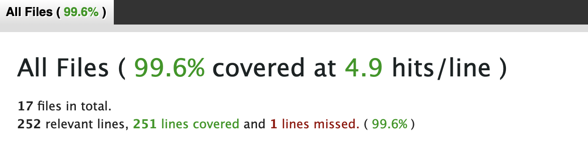

# Page Views Analyzer
This analyze the page views count and display most viewed and uniquely viewed pages in descending order.  

# Assumptions
* Each page path starts with '/'
* Raise error if any record in the file is invalid

# Approach
* Read the file
* Prepare a hash where I stored each page path and their corresponding view count by each IP
````
{
    'page_path_1' => { 'ip_1' => <count_in_integer>, 'ip_2' => <count_in_integer> },
    'page_path_2' => { 'ip_1' => <count_in_integer> }
}
````
* Pass this hash to calculate two hash one for most_visited_pages and most_uniquely_visited_pages
* most_visited_pages hash page_path as key and total views for this page as value for each page_path
* most_visited_pages hash page_path as key and total number of ips as value for each page_path
* Display service responsible for displaying result on the screen
  
## Installation
* install Ruby ruby-2.6.5 version

## Setup
* git clone git@github.com:sandeep-patle1508/page_views_analyzer.git
* Go to application folder
`cd page_views_analyzer`
* Install gems by running `bundle install` command

We are ready to run the application.

## Usage
We can run this application for any log file. 

Command: `ruby ./main.rb <file_name>`
Example for sample file: `ruby ./main.rb webserver.log`

It will display the most viewed and most uniquely viewed pages on the screen.  

## Output Screenshot


## Test
To run rspec test cases use command `bundle exec rspec` 

## Code coverage
I have used SimpleCov gem to analysis code coverage. 
After running your tests, open coverage/index.html in the browser.

We can use following command to open converage report:

`open coverage/index.html` 

Code coverage:


## Rubocop 
To analyze and check format of code I have used rubocop gem.
You can run this by command `rubocop`


## Tools
* Ruby ruby-2.6.5
* Rspec
* rubocop
* simplecov


